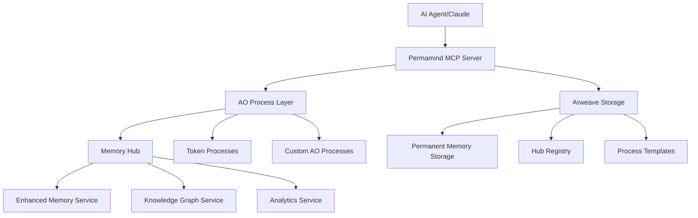

# Permamind 🧠⚡️

[](https://www.typescriptlang.org/)
[](https://nodejs.org/)
[](https://ao.arweave.dev/)
[](https://arweave.org/)
[](https://modelcontextprotocol.io/)
[](https://opensource.org/licenses/MIT)

**The world's first permanent, decentralized AI memory system built on Arweave and AO (Autonomous Objects)**

Permamind is a Model Context Protocol (MCP) server that provides an immortal memory layer for AI agents, leveraging Arweave's permanent storage and the AO ecosystem for decentralized computation. Unlike traditional memory systems that are ephemeral and centralized, Permamind creates truly persistent AI memory that survives forever.

---

## 🌟 Why Permamind?

| Traditional AI Memory | Permamind |
|----------------------|-----------|
| ❌ Ephemeral sessions | ✅ Permanent storage |
| ❌ Centralized servers | ✅ Decentralized AO network |
| ❌ Limited context | ✅ Unlimited knowledge graphs |
| ❌ No cross-session learning | ✅ Continuous learning & memory |
| ❌ Vendor lock-in | ✅ Open, permissionless protocol |

## 🚀 Key Features

### 🧠 **Immortal AI Memory**
- **Permanent Storage**: All memories stored forever on Arweave blockchain
- **Rich Metadata**: Context, importance scoring, and semantic relationships
- **Memory Types**: Conversation, reasoning, knowledge, procedures, workflows
- **Advanced Search**: Multi-filter, relevance-ranked memory retrieval

### 🌐 **Decentralized Architecture**
- **AO-Powered**: Leverage Autonomous Objects for computation
- **Hub System**: Distributed memory nodes with the Velocity Protocol
- **Permissionless**: No gatekeepers, true Web3 infrastructure
- **Cross-Agent Memory**: Shared knowledge between AI systems

### 🔗 **Knowledge Graphs**
- **Memory Relationships**: Link related concepts with typed connections
- **Reasoning Chains**: Document AI decision-making processes
- **Circular Reference Detection**: Maintain graph integrity
- **Shortest Path Analysis**: Navigate knowledge networks efficiently

### 🛠 **Universal AO Integration**
- **Natural Language Interface**: Talk to any AO process in plain English
- **Markdown Documentation**: Simple process documentation format
- **Token Operations**: Advanced minting strategies and credit notice system
- **Smart Templates**: Auto-detect common process types (tokens, NFTs, DAOs)

### 🎯 **Developer Experience**
- **MCP Native**: Works with Claude, VS Code, Cursor, and more
- **TypeScript First**: Full type safety and excellent DX
- **Zero Config**: Automatic wallet generation and hub deployment
- **Comprehensive Testing**: 95%+ test coverage with Vitest

---

## 🏗 Architecture Overview



**Core Components:**
- **MCP Server**: FastMCP-based server exposing AI memory tools
- **AO Integration**: Direct communication with Autonomous Objects
- **Memory Services**: Enhanced AI memory with metadata and relationships
- **Token System**: Advanced minting strategies with credit notice detection
- **Velocity Protocol**: Decentralized hub discovery and event routing

---

## ⚡️ Quick Start

### Prerequisites

- **Node.js 20+** ([Download](https://nodejs.org/))
- **Git** ([Download](https://git-scm.com/))
- An **MCP-compatible client** (Claude Desktop, VS Code, Cursor)

### 1. Clone & Install

```bash
git clone https://github.com/ALLiDoizCode/Permamind.git
cd Permamind
npm install
```

### 2. Build & Test

```bash
# Build the project
npm run build

# Run tests to verify installation
npm test

# Start development server
npm run dev
```

### 3. Configure MCP Client

#### For Claude Desktop

Add to your `claude_desktop_config.json`:

```json
{
  "mcpServers": {
    "permamind": {
      "command": "tsx",
      "args": ["/path/to/Permamind/src/server.ts"],
      "env": {
        "SEED_PHRASE": "your_optional_seed_phrase_here"
      }
    }
  }
}
```

#### For VS Code/Cursor

1. Install the MCP extension
2. Add Permamind server configuration
3. Restart your editor

### 4. Generate Your Identity (Optional)

```bash
# Generate a new seed phrase for persistent identity
node -e "
const { generateMnemonic } = require('bip39');
console.log('Your seed phrase:', generateMnemonic());
console.log('⚠️  Save this securely - it controls your permanent memory!');
"
```

### 5. Verify Installation

Use the `getServerInfo` tool in your MCP client to verify Permamind is running correctly.

---

## 🛠 MCP Tools Reference

### Core Memory Operations

| Tool | Purpose | Key Parameters |
|------|---------|----------------|
| `addMemory` | Store basic conversation memory | `content`, `role`, `p` |
| `addMemoryEnhanced` | Store AI memory with metadata | `content`, `importance`, `memoryType`, `context` |
| `searchMemories` | Basic keyword search | `query`, `conversationId` |
| `searchMemoriesAdvanced` | Advanced filtered search | `query`, `filters`, `ranking` |
| `getAllMemories` | Retrieve all memories | `conversationId` (optional) |
| `getMemoryAnalytics` | Usage patterns & insights | `p` (optional) |

### Knowledge Graph Operations

| Tool | Purpose | Key Parameters |
|------|---------|----------------|
| `linkMemories` | Create memory relationships | `sourceId`, `targetId`, `relationshipType`, `strength` |
| `addReasoningChain` | Store AI decision processes | `chainId`, `steps`, `outcome` |
| `getMemoryRelationships` | Find related memories | `memoryId` (optional) |

### AO Process Integration

| Tool | Purpose | Key Parameters |
|------|---------|----------------|
| `executeProcessAction` | Natural language AO communication | `processId`, `request`, `processMarkdown` |
| `executeTokenRequest` | Simplified token operations | `processId`, `request` |
| `createSimpleToken` | Deploy new token contracts | `config` (name, ticker, supply, etc.) |
| `createAdvancedToken` | Deploy with minting strategies | `config` (Basic/Cascade/DoubleMint) |

### Utility Operations

| Tool | Purpose | Key Parameters |
|------|---------|----------------|
| `getServerInfo` | Server status & identity | None |
| `addMemoriesBatch` | Bulk memory operations | `memories[]`, `p` |

---

## 💡 Usage Examples

### Basic AI Memory

```javascript
// Store a conversation memory
await mcp.addMemory({
  content: "User prefers dark mode in all applications",
  role: "system",
  p: "user_public_key"
});
```

### Enhanced Memory with AI Features

```javascript
// Store enriched memory with metadata
await mcp.addMemoryEnhanced({
  content: "Implemented JWT authentication with refresh tokens",
  importance: 0.9,
  memoryType: "knowledge",
  context: {
    sessionId: "auth_implementation_2024",
    topic: "authentication",
    domain: "web_development"
  },
  metadata: {
    tags: ["security", "jwt", "best-practices"]
  },
  p: "developer_public_key"
});
```

### Knowledge Graph Building

```javascript
// Link related memories
await mcp.linkMemories({
  sourceMemoryId: "jwt_implementation_memory",
  targetMemoryId: "security_best_practices_memory",
  relationshipType: "supports",
  strength: 0.85
});
```

### Natural Language Token Operations

```javascript
// Simple token transfer
await mcp.executeTokenRequest({
  processId: "your-token-process-id",
  request: "Send 100 tokens to alice with memo 'payment for consulting'"
});

// Check balance
await mcp.executeTokenRequest({
  processId: "your-token-process-id", 
  request: "What's my current balance?"
});
```

### Advanced Token Creation

```javascript
// Create token with cascade minting
await mcp.createAdvancedToken({
  name: "MyProject Token",
  ticker: "MPT",
  mintingStrategy: "Cascade",
  initialSupply: 1000000,
  cascadeConfig: {
    rewardPercentage: 5,
    thresholdAmount: 1000,
    maxRewards: 10
  }
});
```

### Complex AO Process Communication

```javascript
// Interact with any AO process using natural language
await mcp.executeProcessAction({
  processId: "dao-governance-process",
  processMarkdown: `
# DAO Governance Process

## vote
Cast a vote on a proposal
- proposalId: The proposal ID (required)
- vote: yes/no/abstain (required) 
- reason: Voting rationale (optional)

## createProposal
Create a new governance proposal
- title: Proposal title (required)
- description: Detailed description (required)
- votingPeriod: Days for voting (optional, default 7)
`,
  request: "Vote yes on proposal #42 with reason 'This will improve token utility'"
});
```

---

## 🧠 Memory Types & Architecture

### Memory Classification

| Type | Purpose | Use Cases |
|------|---------|-----------|
| `conversation` | Dialog interactions | Chat history, user preferences |
| `reasoning` | AI decision processes | Logic chains, problem-solving |
| `knowledge` | Factual information | Facts, concepts, definitions |
| `procedure` | Step-by-step processes | Workflows, methodologies |
| `enhancement` | Code improvements | Optimizations, refactoring |
| `performance` | Metrics & benchmarks | Speed tests, comparisons |
| `workflow` | Business processes | AO workflow definitions |

### Relationship Types

- **`causes`** → Causal relationships (A leads to B)
- **`supports`** → Evidence or reinforcement  
- **`contradicts`** → Conflicting information
- **`extends`** → Elaboration or expansion
- **`references`** → Citations or mentions

### Importance Scoring

- **0.9-1.0**: Critical knowledge, core concepts
- **0.7-0.8**: Important facts, useful procedures  
- **0.5-0.6**: Relevant context, supporting details
- **0.3-0.4**: Minor details, tangential information
- **0.0-0.2**: Low priority, cleanup candidates

---

## 🔧 Advanced Configuration

### Environment Variables

```bash
# Required: Your Arweave wallet seed phrase (12 words)
SEED_PHRASE="word1 word2 word3 ... word12"

# Optional: Development settings
NODE_ENV=development|production
DEBUG=true
MCP_LOG_LEVEL=info|debug|error

# Optional: Custom AO network endpoints
AO_CU_URL=https://cu.velocity.cloudnet.marshal.ao
AO_MU_URL=https://mu.velocity.cloudnet.marshal.ao
AO_GATEWAY_URL=https://gateway.velocity.cloudnet.marshal.ao
```

### Package Scripts

```bash
# Development
npm run dev          # Start with hot reload
npm run build        # Compile TypeScript
npm run start        # Production server

# Quality Assurance  
npm run lint         # ESLint + Prettier check
npm run format       # Auto-fix formatting
npm run type-check   # TypeScript validation
npm test             # Run test suite
npm run test:coverage # Coverage report

# CI/CD Pipeline
npm run ci:quality   # Full quality check
npm run audit        # Security audit
```

### Advanced Hub Configuration

```typescript
// Custom hub registry configuration
const hubConfig = {
  registryId: "g_eSbkmD4LzfZtXaCLmeMcLIBQrqxnY-oFQJJNMIn4w",
  zone: "custom-zone-name",
  permissions: {
    read: ["public"],
    write: ["owner", "trusted-agents"]
  }
};
```

---

## 🏗 Technical Architecture

### Core Services

#### AIMemoryService
- **Enhanced memory operations** with AI-specific metadata
- **Batch processing** for efficient bulk operations
- **Memory analytics** and usage pattern analysis
- **Context management** for grouped memory spaces

#### ProcessCommunicationService  
- **Natural language parsing** for AO process interaction
- **Dynamic handler detection** from markdown documentation
- **Parameter extraction** from plain English requests
- **Response interpretation** with structured formatting

#### TokenService
- **Advanced minting strategies**: Basic, Cascade, DoubleMint
- **Credit notice detection** for proper transfer handling
- **Template generation** for instant token deployment
- **Configuration validation** with comprehensive error handling

#### DefaultProcessService
- **Process type detection** from handler patterns
- **Template matching** for common AO process types
- **Smart suggestions** based on partial requests
- **Auto-completion** for known operation patterns

### AO Integration Layer

#### Message Routing
```typescript
interface AOMessage {
  processId: string;
  tags: Tag[];
  data?: string;
  isWrite?: boolean; // Automatic read/write detection
}
```

#### Handler Detection
```typescript
interface HandlerInfo {
  action: string;
  description: string;
  parameters: ParameterInfo[];
  isWrite: boolean;
  examples?: string[];
}
```

### Memory Storage Schema

#### Enhanced Memory Structure
```typescript
interface AIMemory extends Memory {
  importance: number;        // 0-1 relevance score
  memoryType: MemoryType;   // Classification
  context: MemoryContext;   // Rich metadata
  metadata: {
    tags: string[];
    accessCount: number;
    lastAccessed: string;
  };
}
```

#### Knowledge Graph Schema
```typescript
interface MemoryLink {
  targetId: string;
  type: RelationshipType;
  strength: number; // 0-1 connection strength
}
```

---

## 🧪 Testing & Quality

### Test Coverage

- **Unit Tests**: Individual service testing
- **Integration Tests**: Cross-service functionality  
- **End-to-End Tests**: Full MCP tool workflows
- **Coverage Target**: 90% functions, 85% lines, 75% branches

### Quality Tools

- **TypeScript**: Strict mode with full type checking
- **ESLint**: Comprehensive linting with TypeScript rules
- **Prettier**: Automatic code formatting
- **Vitest**: Fast, modern testing framework
- **Security**: Regular dependency auditing

### Running Tests

```bash
# Full test suite
npm test

# Watch mode for development
npm run test:watch

# Coverage report
npm run test:coverage

# Specific test file
npx vitest run src/services/AIMemoryService.test.ts
```

---

## 🚨 Troubleshooting

### Common Issues

#### "SEED_PHRASE not set" Warning
```bash
# Generate a new seed phrase
node -e "console.log(require('bip39').generateMnemonic())"

# Set as environment variable
export SEED_PHRASE="your twelve word seed phrase here"
```

#### MCP Client Connection Issues
1. Verify Node.js 20+ is installed: `node --version`
2. Build the project: `npm run build`
3. Check MCP client configuration syntax
4. Restart your MCP client (Claude, VS Code, etc.)

#### AO Network Connectivity
- Default uses Marshal testnet (free)
- Check network status at [Marshal AO](https://x.com/Marshal_AO)
- Verify firewall allows outbound HTTPS connections

#### Memory Search Issues
- Check hub deployment: Use `getServerInfo` tool
- Verify seed phrase consistency across sessions
- Allow time for AO message propagation (30-60 seconds)

### Debug Mode

```bash
# Enable verbose logging
DEBUG=true npm run dev

# Check MCP tool definitions
node -e "
const server = require('./dist/server.js');
console.log(JSON.stringify(server.tools, null, 2));
"
```

### Getting Help

- 📖 **Documentation**: [docs/](./docs/)
- 🐛 **Bug Reports**: [GitHub Issues](https://github.com/ALLiDoizCode/Permamind/issues)
- 💬 **Discussions**: [GitHub Discussions](https://github.com/ALLiDoizCode/Permamind/discussions)
- 🐦 **Updates**: Follow [@ALLiDoizCode](https://twitter.com/ALLiDoizCode)

---

## 🤝 Contributing

We welcome contributions from developers, researchers, and AI enthusiasts!

### Quick Contribution Guide

1. **Fork** the repository
2. **Clone** your fork: `git clone https://github.com/yourusername/Permamind.git`
3. **Create** a feature branch: `git checkout -b feature/amazing-feature`
4. **Make** your changes with tests
5. **Run** quality checks: `npm run ci:quality`
6. **Commit** with conventional commits: `git commit -m 'feat: add amazing feature'`
7. **Push** to your fork: `git push origin feature/amazing-feature`
8. **Create** a Pull Request

### Development Setup

```bash
# Clone and setup
git clone https://github.com/ALLiDoizCode/Permamind.git
cd Permamind
npm install

# Development workflow
npm run dev        # Start development server
npm run test:watch # Run tests in watch mode
npm run lint       # Check code quality
```

### Contribution Areas

- 🧠 **Memory Systems**: Enhanced AI memory algorithms
- 🌐 **AO Integration**: New process types and templates
- 🔍 **Search & Analytics**: Improved memory retrieval
- 📚 **Documentation**: Guides, examples, tutorials
- 🧪 **Testing**: Additional test coverage
- 🛡 **Security**: Vulnerability research and fixes

### Code Style

- **TypeScript**: Strict mode, explicit types
- **Functions**: Prefer pure functions and immutability
- **Comments**: JSDoc for public APIs
- **Testing**: Test-driven development preferred
- **Commits**: Conventional Commits format

---

## 📚 Documentation

### Core Guides
- **[Getting Started](docs/getting-started.md)** - Setup and first steps
- **[Architecture Guide](docs/architecture.md)** - System design and components
- **[API Reference](docs/api-reference.md)** - Complete tool documentation
- **[Memory System](docs/memory-system.md)** - AI memory concepts and usage

### Integration Guides
- **[AO Process Integration](docs/ao-integration.md)** - Connect any AO process
- **[Token Development](docs/token-development.md)** - Build token systems
- **[Knowledge Graphs](docs/knowledge-graphs.md)** - Memory relationships
- **[MCP Client Setup](docs/mcp-setup.md)** - Configure Claude, VS Code, etc.

### Examples & Tutorials
- **[Basic Memory Operations](examples/basic-memory.md)**
- **[Advanced Search Patterns](examples/advanced-search.md)**
- **[Token Operations](examples/token-operations.md)**
- **[Knowledge Graph Building](examples/knowledge-graph.md)**

### Advanced Topics
- **[Custom Process Templates](docs/custom-templates.md)**
- **[Performance Optimization](docs/performance.md)**
- **[Security Considerations](docs/security.md)**
- **[Deployment Strategies](docs/deployment.md)**

---

## 🌐 Ecosystem & Links

### Core Technologies
- **[AO (Autonomous Objects)](https://ao.arweave.dev/)** - Decentralized compute layer
- **[Arweave](https://arweave.org/)** - Permanent data storage
- **[Model Context Protocol](https://modelcontextprotocol.io/)** - AI tool standard
- **[FastMCP](https://github.com/jlowin/fastmcp)** - TypeScript MCP framework
- **[Velocity Protocol](https://github.com/SpaceTurtle-Dao/velocity-protocol)** - Decentralized social protocol

### Community & Support
- **GitHub**: https://github.com/ALLiDoizCode/Permamind
- **Documentation**: https://permamind.ai/docs (coming soon)
- **Community**: [Discord](https://discord.gg/permamind) (coming soon)
- **Updates**: [@ALLiDoizCode](https://twitter.com/ALLiDoizCode)

### Related Projects
- **[AO Cookbook](https://github.com/permaweb/ao-cookbook)** - AO development guide
- **[Arweave Cookbook](https://cookbook.arweave.dev/)** - Arweave development
- **[Claude Desktop](https://claude.ai/download)** - Primary MCP client

---

## 📄 License

This project is licensed under the MIT License - see the [LICENSE](LICENSE) file for details.

## 🙏 Acknowledgments

- **AO & Arweave Teams** - For building the permanent compute and storage layers
- **Anthropic** - For creating the Model Context Protocol standard
- **FastMCP Contributors** - For the excellent TypeScript MCP framework
- **Community Contributors** - For feedback, testing, and contributions

---

<div align="center">

**🧠 Building the Future of AI Memory 🧠**

*Permanent • Decentralized • Immortal*

[Get Started](docs/getting-started.md) • [Documentation](docs/) • [Examples](examples/) • [Community](https://discord.gg/permamind)

</div>