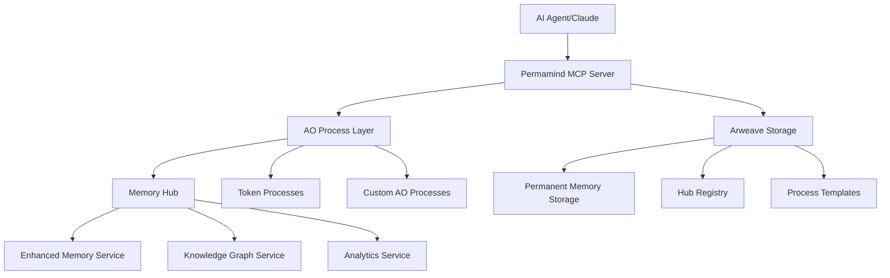

# Permamind 🧠⚡️

**The world's first permanent, decentralized AI memory system built on Arweave and AO**

Permamind is a Model Context Protocol (MCP) server that provides an immortal memory layer for AI agents, leveraging Arweave's permanent storage and the AO ecosystem for decentralized computation. Unlike traditional memory systems that are ephemeral and centralized, Permamind creates truly persistent AI memory that survives forever.

---

## 🌟 Why Permamind?

| Traditional AI Memory        | Permamind                        |
| ---------------------------- | -------------------------------- |
| ❌ Ephemeral sessions        | ✅ Permanent storage             |
| ❌ Centralized servers       | ✅ Decentralized AO network      |
| ❌ Limited context           | ✅ Unlimited knowledge graphs    |
| ❌ No cross-session learning | ✅ Continuous learning & memory  |
| ❌ Vendor lock-in            | ✅ Open, permissionless protocol |

## 🚀 Key Features

### 🧠 **Immortal AI Memory**

- **Permanent Storage**: All memories stored forever on Arweave blockchain
- **Rich Metadata**: Context, importance scoring, and semantic relationships
- **Memory Types**: Conversation, reasoning, knowledge, procedures, workflows
- **Advanced Search**: Multi-filter, relevance-ranked memory retrieval

### 🌐 **Decentralized Architecture**

- **AO-Powered**: Leverage AO compute layer for decentralized processing
- **Hub System**: Distributed memory nodes with the Velocity Protocol
- **Permissionless**: No gatekeepers, true Web3 infrastructure
- **Cross-Agent Memory**: Shared knowledge between AI systems

### 🔗 **Knowledge Graphs**

- **Memory Relationships**: Link related concepts with typed connections
- **Reasoning Chains**: Document AI decision-making processes
- **Circular Reference Detection**: Maintain graph integrity
- **Shortest Path Analysis**: Navigate knowledge networks efficiently

### 🛠 **Universal AO Integration**

- **Natural Language Interface**: Talk to any AO process in plain English
- **Markdown Documentation**: Simple process documentation format
- **Token Operations**: Advanced minting strategies and credit notice system
- **Smart Templates**: Auto-detect common process types (tokens, NFTs, DAOs)

### 🎯 **Developer Experience**

- **MCP Native**: Works with Claude, VS Code, Cursor, and more
- **TypeScript First**: Full type safety and excellent DX
- **Zero Config**: Automatic wallet generation and hub deployment
- **Comprehensive Testing**: 95%+ test coverage with Vitest

---

## 📚 Documentation

### 📖 **Core Guides**

- **[🚀 Installation & Quick Start](docs/installation.md)** - Get up and running in 5 minutes
- **[🛠 MCP Tools Reference](docs/tools-reference.md)** - Complete API documentation
- **[💡 Usage Examples](docs/examples.md)** - Practical code examples and patterns
- **[🏗 Architecture & Configuration](docs/architecture.md)** - Technical deep dive and advanced setup

### 🔧 **Support & Development**

- **[🚨 Troubleshooting](docs/troubleshooting.md)** - Common issues and solutions
- **[🤝 Contributing Guide](docs/contributing.md)** - Join the development community
- **[🧪 Testing Guide](docs/testing.md)** - Quality assurance and testing patterns

### 🌐 **Integration Guides**

- **[AO Process Integration](docs/ao-integration.md)** - Connect any AO process
- **[Token Development](docs/token-development.md)** - Build token systems
- **[Knowledge Graphs](docs/knowledge-graphs.md)** - Memory relationships
- **[MCP Client Setup](docs/mcp-setup.md)** - Configure Claude, VS Code, etc.

### 📊 **Advanced Topics**

- **[Custom Process Templates](docs/custom-templates.md)** - Extend functionality
- **[Performance Optimization](docs/performance.md)** - Scale your implementation
- **[Security Considerations](docs/security.md)** - Best practices and hardening
- **[Deployment Strategies](docs/deployment.md)** - Production deployment

---

## 🏗 Architecture Overview

**Core Components:**

- **MCP Server**: FastMCP-based server exposing AI memory tools
- **AO Integration**: Direct communication with AO processes
- **Memory Services**: Enhanced AI memory with metadata and relationships
- **Token System**: Advanced minting strategies with credit notice detection
- **Velocity Protocol**: Decentralized hub discovery and event routing

---

## 🌐 Ecosystem & Links

### Core Technologies

- **[AO Cookbook](https://cookbook_ao.g8way.io/)** - AO development guide and compute layer
- **[Arweave](https://arweave.org/)** - Permanent data storage
- **[Model Context Protocol](https://modelcontextprotocol.io/)** - AI tool standard
- **[FastMCP](https://github.com/jlowin/fastmcp)** - TypeScript MCP framework
- **[Velocity Protocol](https://github.com/SpaceTurtle-Dao/velocity-protocol)** - Decentralized social protocol

### Community & Support

- **GitHub**: https://github.com/ALLiDoizCode/Permamind
- **Documentation**: https://permamind.ai/docs (coming soon)
- **Community**: [Discord](https://discord.gg/permamind) (coming soon)
- **Updates**: [@ALLiDoizCode](https://twitter.com/ALLiDoizCode)

### Related Projects

- **[AO Cookbook](https://cookbook_ao.g8way.io/)** - AO development guide
- **[Arweave Cookbook](https://cookbook.arweave.dev/)** - Arweave development
- **[Claude Desktop](https://claude.ai/download)** - Primary MCP client

---

## 📄 License

This project is licensed under the MIT License - see the [LICENSE](LICENSE) file for details.

## 🙏 Acknowledgments

- **AO & Arweave Teams** - For building the permanent compute and storage layers
- **Anthropic** - For creating the Model Context Protocol standard
- **FastMCP Contributors** - For the excellent TypeScript MCP framework
- **Community Contributors** - For feedback, testing, and contributions

---

**🧠 Building the Future of AI Memory 🧠**

_Permanent • Decentralized • Immortal_

[🚀 Get Started](docs/installation.md) • [📚 Documentation](docs/) • [💡 Examples](docs/examples.md) • [🤝 Community](https://discord.gg/permamind)

