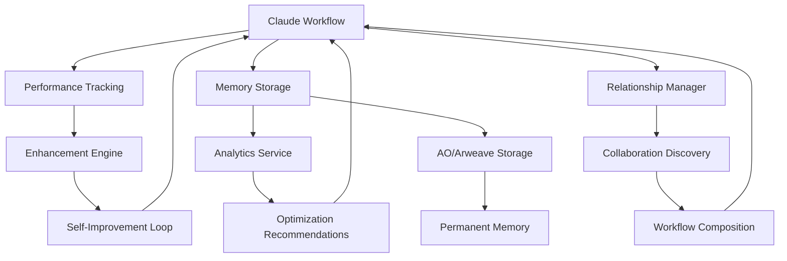

# 🧠 Decentralized Self-Enhancing Claude Workflow Ecosystem

> **Built on Permamind's Immortal Memory Layer**  
> _A comprehensive system for creating, enhancing, and orchestrating intelligent Claude workflows that learn, collaborate, and continuously improve._

## 🎯 Overview

This ecosystem transforms Permamind from a simple memory storage system into a sophisticated platform for building self-enhancing AI workflows. Claude workflows can now:

- **Learn from their own performance** and automatically optimize
- **Collaborate with other workflows** through decentralized relationships
- **Inherit improvements** from successful peer workflows
- **Compose together** to create more powerful combined capabilities
- **Store all knowledge permanently** on Arweave for immortal memory
- **Continuously evolve** through multiple learning mechanisms

## 🏗️ Architecture Overview

### Core Components



## 📁 File Structure

```
src/
├── models/
│   └── WorkflowMemory.ts          # Extended memory types & interfaces
├── services/
│   ├── WorkflowPerformanceTracker.ts    # Performance metrics & analysis
│   ├── WorkflowRelationshipManager.ts   # Workflow connections & inheritance
│   ├── WorkflowEnhancementEngine.ts     # Self-improvement system
│   └── WorkflowAnalyticsService.ts      # Comprehensive analytics
└── server.ts                      # Extended MCP tools (8 new tools)
```

## 🔧 Core Components

### 1. Extended Memory Architecture (`WorkflowMemory.ts`)

#### New Memory Types

- **`workflow`** - Workflow execution memories with metadata
- **`enhancement`** - Improvement tracking and validation
- **`performance`** - Metrics and performance data

#### Workflow Relationships

- **`inherits`** - Child workflow learns from parent
- **`composes`** - Workflow uses another as component
- **`enhances`** - Improved version of another workflow
- **`triggers`** - Workflow activates another
- **`depends_on`** - Requires another workflow
- **`replaces`** - Supersedes another workflow

#### Performance Tracking

```typescript
interface WorkflowPerformance {
  executionTime: number;
  success: boolean;
  errorRate: number;
  resourceUsage: ResourceMetrics;
  qualityScore: number;
  userSatisfaction?: number;
  completionRate: number;
  retryCount: number;
  lastExecuted: string;
}
```

#### Enhancement System

```typescript
interface Enhancement {
  id: string;
  type: EnhancementType;
  description: string;
  impact: number;
  actualImpact?: number;
  validation: ValidationResult;
  code?: string;
  parameters?: Record<string, any>;
}
```

### 2. Performance Tracking System (`WorkflowPerformanceTracker.ts`)

#### Key Features

- **Metrics Collection**: Comprehensive performance data recording
- **Enhancement Identification**: AI-driven improvement suggestions
- **Trend Analysis**: Performance degradation and optimization detection
- **Validation System**: Enhancement testing and risk assessment
- **Recommendation Engine**: Automated optimization suggestions

#### Usage Example

```typescript
// Record performance
tracker.recordPerformance(workflowId, {
  executionTime: 1500,
  success: true,
  errorRate: 0.02,
  qualityScore: 0.92,
  resourceUsage: { memoryUsage: 128, cpuTime: 800, ... }
});

// Get recommendations
const recommendations = tracker.generateOptimizationRecommendations(workflowId);
```

### 3. Relationship Management (`WorkflowRelationshipManager.ts`)

#### Capabilities

- **Dynamic Relationships**: Create and manage workflow connections
- **Inheritance Chains**: Track workflow evolution and enhancement propagation
- **Collaboration Discovery**: Find workflow partnership opportunities
- **Dependency Management**: Circular dependency detection and resolution
- **Network Analysis**: Ecosystem connectivity and influence metrics

#### Usage Example

```typescript
// Create inheritance relationship
relationshipManager.createRelationship(
  "child-workflow-id",
  "parent-workflow-id",
  "inherits",
  0.8, // strength
);

// Find collaboration opportunities
const opportunities =
  relationshipManager.findCollaborationOpportunities(workflowId);
```

### 4. Self-Enhancement Engine (`WorkflowEnhancementEngine.ts`)

#### Learning Sources

- **🤖 Self**: Performance-based optimization
- **👥 Peer**: Learning from other workflows
- **👤 User**: Human feedback integration
- **📊 Analytics**: Data-driven improvements
- **❌ Error**: Failure-driven learning
- **✨ Emergent**: Discovery through combination

#### Enhancement Cycle

```typescript
// Run enhancement cycle
const result = await enhancementEngine.runEnhancementCycle(workflowId);
// Returns: { enhancements, applied, rejected, nextCycleIn }

// Process user feedback
const userEnhancements = enhancementEngine.processUserFeedback(
  workflowId,
  "The workflow was too slow",
  2.5, // rating out of 5
);
```

### 5. Analytics & Insights (`WorkflowAnalyticsService.ts`)

#### Metrics Provided

- **Performance Trends**: Execution time, success rates, quality scores
- **Enhancement Effectiveness**: Impact analysis by type and source
- **Collaboration Metrics**: Network density, knowledge exchange
- **Learning Efficiency**: Adaptation rates, knowledge retention
- **Health Scoring**: Ecosystem-wide performance assessment

#### Usage Example

```typescript
// Get comprehensive analytics
const analytics = analyticsService.getWorkflowAnalytics(workflowId);

// Get health score
const healthScore = analyticsService.getEcosystemHealthScore();

// Generate recommendations
const recommendations = analyticsService.generateRecommendations(workflowId);
```

## 🛠️ MCP Tools

### New Workflow-Specific Tools (8 total)

1. **`addWorkflowMemory`** - Store workflow execution memories
2. **`trackWorkflowPerformance`** - Record performance metrics
3. **`createWorkflowRelationship`** - Link workflows together
4. **`addWorkflowEnhancement`** - Record improvements
5. **`searchWorkflowMemories`** - Find workflow patterns
6. **`getWorkflowAnalytics`** - Comprehensive insights
7. **`createWorkflowComposition`** - Orchestrate multiple workflows
8. **Enhanced existing tools** with workflow support

### Example Tool Usage

```javascript
// Track performance
await trackWorkflowPerformance({
  workflowId: "data-processor-v2",
  p: userPublicKey,
  executionTime: 1200,
  success: true,
  qualityScore: 0.95,
  memoryUsage: 64,
  userSatisfaction: 0.9,
});

// Create workflow relationship
await createWorkflowRelationship({
  sourceWorkflowId: "enhanced-analyzer",
  targetWorkflowId: "basic-analyzer",
  relationshipType: "enhances",
  strength: 0.9,
  p: userPublicKey,
});

// Get analytics and recommendations
const analytics = await getWorkflowAnalytics({
  workflowId: "my-workflow",
  p: userPublicKey,
});
```

## 🚀 Usage Scenarios

### Scenario 1: Individual Workflow Self-Enhancement

```typescript
// 1. Claude workflow executes a task
const result = await executeTask(input);

// 2. Performance is automatically tracked
await trackWorkflowPerformance({
  workflowId: "task-executor",
  executionTime: result.timing,
  success: result.success,
  qualityScore: result.quality,
  // ... other metrics
});

// 3. Enhancement engine identifies improvements
const enhancements = await runEnhancementCycle("task-executor");

// 4. Validated improvements are automatically applied
// 5. Next execution benefits from enhancements
```

### Scenario 2: Peer Learning Between Workflows

```typescript
// 1. High-performing workflow shares knowledge
await createWorkflowRelationship({
  sourceWorkflowId: "student-workflow",
  targetWorkflowId: "expert-workflow",
  relationshipType: "inherits",
  strength: 0.8,
});

// 2. Enhancement engine discovers peer improvements
const peerEnhancements = await learnFromPeers("student-workflow");

// 3. Adaptations are automatically applied
// 4. Student workflow improves rapidly
```

### Scenario 3: Workflow Composition

```typescript
// 1. Create composition of multiple workflows
await createWorkflowComposition({
  compositionId: "data-pipeline",
  name: "Complete Data Processing Pipeline",
  workflowSteps: JSON.stringify([
    { workflowId: "data-collector", order: 1 },
    { workflowId: "data-processor", order: 2 },
    { workflowId: "data-analyzer", order: 3 },
  ]),
  executionStrategy: "pipeline",
});

// 2. Composition creates emergent capabilities
// 3. Individual workflows continue to improve
// 4. Overall pipeline becomes more powerful
```

### Scenario 4: Error-Driven Learning

```typescript
// 1. Workflow encounters error
try {
  await executeWorkflow(complexInput);
} catch (error) {
  // 2. Enhancement engine creates fix
  const errorEnhancement = createEnhancementFromError(
    workflowId,
    error,
    context,
  );

  // 3. Fix is validated and applied
  await applyEnhancement(workflowId, errorEnhancement);

  // 4. Future executions handle similar errors gracefully
}
```

## 📊 Analytics Dashboard Concepts

### Workflow Performance View

- **Execution Trends**: Time series of performance metrics
- **Success Rate Distribution**: Workflow reliability over time
- **Quality Score Evolution**: Output quality improvements
- **Resource Utilization**: Memory, CPU, network usage patterns

### Enhancement Effectiveness View

- **Impact Distribution**: Enhancement effectiveness by type
- **Success Rate by Source**: Which learning sources work best
- **Risk vs Reward**: Enhancement impact vs risk assessment
- **Application Timeline**: When enhancements were applied

### Ecosystem Health View

- **Network Topology**: Workflow relationship visualization
- **Collaboration Metrics**: Knowledge sharing statistics
- **Learning Velocity**: Rate of ecosystem improvement
- **Health Score Trends**: Overall ecosystem performance

### Individual Workflow View

- **Performance Profile**: Detailed metrics and trends
- **Enhancement History**: Timeline of improvements
- **Relationship Map**: Connected workflows and dependencies
- **Optimization Opportunities**: Recommended improvements

## 🔮 Future Enhancements

### Phase 2: Advanced Learning

- **Neural Evolution**: Genetic algorithms for workflow optimization
- **Semantic Memory**: Vector embeddings for intelligent memory retrieval
- **Transfer Learning**: Cross-domain knowledge application
- **Meta-Learning**: Learning how to learn more effectively

### Phase 3: Ecosystem Intelligence

- **Swarm Intelligence**: Collective problem-solving capabilities
- **Emergent Behaviors**: Complex capabilities from simple interactions
- **Adaptive Topologies**: Dynamic network restructuring
- **Collective Memory**: Shared knowledge pools

### Phase 4: User Interface

- **Svelte Dashboard**: Interactive workflow ecosystem management
- **Real-time Monitoring**: Live performance tracking
- **Visual Workflow Designer**: Drag-and-drop workflow creation
- **Enhancement Marketplace**: Share improvements across users

## 🎯 Key Benefits

### For Individual Workflows

- **Continuous Improvement**: Never stop getting better
- **Error Recovery**: Learn from failures automatically
- **Performance Optimization**: Always run at peak efficiency
- **Knowledge Retention**: Remember everything forever

### For Workflow Ecosystems

- **Collective Intelligence**: Shared learning across all workflows
- **Emergent Capabilities**: New abilities from combinations
- **Resilient Networks**: Self-healing and adaptation
- **Exponential Growth**: Improvements compound over time

### For Users

- **Hands-off Optimization**: Workflows improve themselves
- **Unprecedented Capabilities**: AI that gets smarter over time
- **Permanent Knowledge**: Nothing is ever forgotten
- **Collaborative AI**: Workflows that work together

## 🛡️ Security & Privacy

### Decentralized Architecture

- **No Central Control**: Fully distributed system
- **Cryptographic Security**: Public key authentication
- **Tamper-Proof Storage**: Immutable Arweave records
- **User Sovereignty**: Complete control over data

### Privacy Protection

- **Local Processing**: Sensitive data stays local
- **Selective Sharing**: Choose what to share with ecosystem
- **Encryption**: Optional encryption for sensitive workflows
- **Access Control**: Fine-grained permission management

## 🚀 Getting Started

### Prerequisites

- Permamind MCP server running
- AO/Arweave access configured
- Claude with MCP integration

### Quick Start

1. **Install**: Use existing Permamind installation
2. **Configure**: Set up workflow tracking
3. **Create**: Build your first self-enhancing workflow
4. **Connect**: Link with other workflows for collaboration
5. **Monitor**: Watch your workflows improve over time

### Example Implementation

```typescript
// Initialize workflow ecosystem
const tracker = new WorkflowPerformanceTracker();
const relationshipManager = new WorkflowRelationshipManager();
const enhancementEngine = new WorkflowEnhancementEngine(
  tracker,
  relationshipManager,
);
const analytics = new WorkflowAnalyticsService(tracker, relationshipManager);

// Create self-enhancing workflow
const workflow = new SelfEnhancingWorkflow({
  id: "my-smart-workflow",
  enhancementEngine,
  performanceTracker: tracker,
  relationshipManager,
});

// Execute and improve
await workflow.execute(input);
// Workflow automatically tracks performance and identifies improvements
```

## 📝 Contributing

This ecosystem is built as an extension to Permamind and follows the same contribution guidelines. Key areas for contribution:

- **New Learning Algorithms**: Implement novel self-improvement methods
- **Enhanced Analytics**: Add new metrics and visualization capabilities
- **Workflow Templates**: Create reusable workflow patterns
- **Integration Tools**: Build connectors for other AI systems
- **Performance Optimizations**: Improve system efficiency

## 📄 License

This project extends Permamind and follows its licensing terms. The workflow ecosystem extensions are designed to be open and collaborative, enabling the creation of a truly decentralized AI enhancement platform.

---

## 🎉 Conclusion

This decentralized self-enhancing Claude workflow ecosystem represents a paradigm shift in AI development. Instead of static, isolated AI systems, we now have:

- **Living, breathing workflows** that continuously improve
- **Collaborative AI networks** that share knowledge and capabilities
- **Immortal memory systems** that never forget valuable insights
- **Emergent intelligence** that grows beyond human design

The future of AI is not just intelligent systems, but **intelligent systems that make themselves and each other more intelligent**. This ecosystem makes that future possible today.

Welcome to the age of **Evolutionary AI** 🚀
