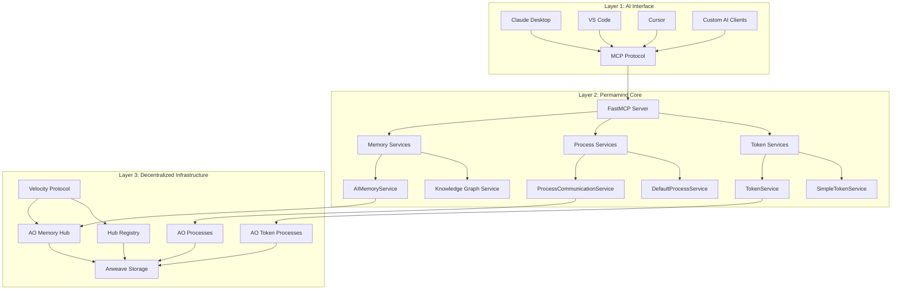

# 🏗 Architecture & Configuration Guide

Comprehensive technical deep dive into Permamind's architecture, advanced configuration options, and system design principles.

## System Overview

Permamind is built on a three-layer architecture that combines the Model Context Protocol (MCP) for AI tool integration, AO for decentralized computation, and Arweave for permanent data storage.



## Core Components

### 1. MCP Server Layer

#### FastMCP Framework

- **Purpose**: Provides the Model Context Protocol interface for AI clients
- **Technology**: TypeScript with Zod schema validation
- **Features**:
  - Server-sent events (SSE) transport
  - Automatic tool discovery and validation
  - Type-safe parameter handling
  - Error handling and response formatting

#### Tool Definition System

```typescript
interface MCPTool {
  name: string;
  description: string;
  inputSchema: ZodSchema;
  handler: (params: unknown) => Promise<ToolResponse>;
}
```

### 2. Memory Management Layer

#### AIMemoryService

- **Core Function**: Enhanced AI memory operations with metadata
- **Key Features**:
  - Importance scoring (0-1 scale)
  - Memory type classification
  - Rich context information
  - Access pattern tracking
  - Batch operations for efficiency

```typescript
interface AIMemory extends Memory {
  importance: number; // Relevance score 0-1
  memoryType: MemoryType; // conversation, knowledge, reasoning, etc.
  context: MemoryContext; // Session, topic, domain metadata
  metadata: {
    tags: string[]; // User-defined tags
    accessCount: number; // Usage tracking
    lastAccessed: string; // Timestamp
  };
}
```

#### Knowledge Graph Service

- **Purpose**: Manage relationships between memories
- **Capabilities**:
  - Typed relationships (causes, supports, contradicts, etc.)
  - Strength scoring for connection quality
  - Circular reference detection
  - Shortest path analysis
  - Relationship analytics

```typescript
interface MemoryLink {
  targetId: string;
  type: RelationshipType; // causes, supports, contradicts, extends, references
  strength: number; // Connection strength 0-1
}
```

#### Reasoning Chain Service

- **Function**: Document AI decision-making processes
- **Structure**:

```typescript
interface ReasoningTrace {
  chainId: string;
  steps: ReasoningStep[]; // Sequential decision steps
  outcome: string; // Final decision or result
}

interface ReasoningStep {
  stepType: "observation" | "thought" | "action";
  content: string;
  confidence: number;
  timestamp: string;
}
```

### 3. Process Communication Layer

#### ProcessCommunicationService

- **Purpose**: Natural language interface to AO processes
- **Key Functions**:
  - Markdown documentation parsing
  - Natural language request interpretation
  - Parameter extraction from plain English
  - AO message construction and routing
  - Response interpretation and formatting

#### Natural Language Service Pipeline

1. **Request Analysis**: Parse user intent from natural language
2. **Handler Matching**: Find appropriate process handlers
3. **Parameter Extraction**: Extract values using regex patterns
4. **Message Construction**: Build AO-compatible message tags
5. **Response Interpretation**: Parse and format AO responses

```typescript
interface HandlerInfo {
  action: string; // Handler name (PascalCase)
  description: string; // Human-readable description
  parameters: ParameterInfo[];
  isWrite: boolean; // Determines read vs write operation
  examples?: string[]; // Usage examples
}
```

#### DefaultProcessService

- **Function**: Auto-detect common AO process types
- **Supported Types**:
  - Token processes (ERC20-like)
  - Future: NFT, DAO, DeFi processes
- **Detection Methods**:
  - Handler pattern matching
  - Request content analysis
  - Process response introspection

### 4. Token System Layer

#### Advanced Minting Strategies

Permamind implements sophisticated token minting patterns:

##### Basic Minting

```lua
-- Simple owner-controlled minting
if msg.From == Owner then
    Balances[msg.Target] = (Balances[msg.Target] or 0) + msg.Quantity
end
```

##### Cascade Minting

```lua
-- Rewards for large transfers
if msg.Quantity >= ThresholdAmount and RewardsIssued < MaxRewards then
    local reward = math.floor(msg.Quantity * RewardPercentage / 100)
    Balances[msg.From] = (Balances[msg.From] or 0) + reward
    RewardsIssued = RewardsIssued + 1
end
```

##### Double Mint Strategy

```lua
-- Mint to both sender and recipient
if msg.From == Owner then
    Balances[msg.Target] = (Balances[msg.Target] or 0) + msg.Quantity
    Balances[msg.From] = (Balances[msg.From] or 0) + msg.Quantity
end
```

#### Credit Notice System

Permamind implements proper AO token transfer detection:

```lua
-- Listen for credit notices, not direct transfers
Handlers.add("Credit-Notice",
  Handlers.utils.hasMatchingTag("Action", "Credit-Notice"),
  function (msg)
    local quantity = tonumber(msg.Quantity)
    local sender = msg.Sender

    -- Update balances based on credit notice
    Balances[ao.id] = (Balances[ao.id] or 0) + quantity

    -- Trigger any minting logic
    handleMinting(sender, quantity)
  end
)
```

### 5. AO Integration Layer

#### Message Routing System

```typescript
interface AOMessage {
  processId: string; // Target AO process
  tags: Tag[]; // Message metadata
  data?: string; // Optional message body
  isWrite?: boolean; // Operation type hint
}
```

#### Read vs Write Detection

```typescript
const WRITE_ACTIONS = new Set([
  "Transfer",
  "Mint",
  "Burn",
  "Register",
  "Vote",
  "Stake",
  "Withdraw",
  "Update-Profile",
]);

function isWriteOperation(tags: Tag[], isWrite?: boolean): boolean {
  if (isWrite !== undefined) return isWrite;

  const actionTag = tags.find((tag) => tag.name === "Action");
  return actionTag ? WRITE_ACTIONS.has(actionTag.value) : false;
}
```

#### Process Template System

Permamind auto-generates process templates for common patterns:

```typescript
interface ProcessDefinition {
  name: string;
  processId: string;
  handlers: HandlerInfo[];
}

// Example token process template
const DEFAULT_TOKEN_PROCESS: ProcessDefinition = {
  name: "AO Token Process",
  processId: "",
  handlers: [
    {
      action: "Balance",
      description: "Get token balance for an account",
      parameters: [{ name: "Target", type: "string", required: false }],
      isWrite: false,
    },
    // ... more handlers
  ],
};
```

### 6. Storage and Persistence Layer

#### Arweave Integration

- **Permanent Storage**: All memories stored forever on Arweave blockchain
- **Immutable Records**: Data cannot be modified once stored
- **Decentralized Access**: No single point of failure
- **Cryptographic Verification**: All data cryptographically signed

#### Velocity Protocol Integration

- **Hub System**: Decentralized memory organization
- **Event-Based Architecture**: Structured data using standard event types
- **Registry System**: Hub discovery and management
- **Protocol Extensions**: AI-specific event types (Kinds 10, 11, 23, 40)

#### Hub Registry Schema

```typescript
interface HubRegistration {
  zoneId: string; // Unique zone identifier
  processId: string; // AO process handling the hub
  owner: string; // Hub owner address
  permissions: {
    read: string[]; // Read access list
    write: string[]; // Write access list
  };
  metadata: {
    name: string;
    description: string;
    tags: string[];
  };
}
```

## Data Flow Architecture

### Memory Storage Flow

1. **AI Client Request** → MCP tool call
2. **Parameter Validation** → Zod schema validation
3. **Memory Processing** → AIMemoryService enhancement
4. **Tag Generation** → Velocity Protocol event tags
5. **AO Message** → Send to memory hub process
6. **Arweave Storage** → Permanent data storage
7. **Response** → Confirmation back to AI client

### Memory Retrieval Flow

1. **Search Request** → Advanced search parameters
2. **Filter Construction** → VIP01 query building
3. **AO Query** → Fetch from memory hub
4. **Data Processing** → Event to memory conversion
5. **Ranking** → Relevance-based sorting
6. **Response** → Formatted results to AI client

### Process Communication Flow

1. **Natural Language Input** → Plain English request
2. **Intent Analysis** → Extract operation and parameters
3. **Handler Matching** → Find appropriate process handler
4. **Message Construction** → Build AO message with tags
5. **Process Execution** → Send to target AO process
6. **Response Processing** → Interpret and format response
7. **Result Delivery** → Structured response to AI client

## Security Architecture

### Cryptographic Security

- **Wallet-Based Identity**: Each instance uses Arweave wallet for signing
- **Message Signing**: All AO messages cryptographically signed
- **Data Integrity**: Arweave provides cryptographic verification
- **Access Control**: Hub-based permission systems

### Input Validation

- **Schema Validation**: Zod schemas for all tool parameters
- **Sanitization**: Input sanitization before AO message construction
- **Rate Limiting**: Built-in rate limiting for AO operations
- **Error Handling**: Comprehensive error boundaries

### Privacy Considerations

- **Local Key Storage**: Private keys stored locally only
- **Optional Seed Phrases**: Users control their identity persistence
- **Permissionless Protocol**: No centralized data collection
- **Open Source**: Full transparency of memory handling

## Performance Architecture

### Optimization Strategies

- **Async Operations**: All I/O operations use async/await
- **Batch Processing**: Bulk memory operations for efficiency
- **Caching**: Intelligent caching of process definitions
- **Connection Pooling**: Efficient AO network connections

### Scalability Design

- **Horizontal Scaling**: Multiple hub instances
- **Load Distribution**: Spread across AO network
- **Storage Efficiency**: Optimized event structures
- **Query Optimization**: Efficient memory retrieval patterns

### Monitoring and Observability

- **Performance Metrics**: Response time tracking
- **Error Logging**: Comprehensive error reporting
- **Usage Analytics**: Memory access patterns
- **Health Checks**: System status monitoring

## Extension Points

### Custom Process Types

```typescript
interface ProcessTemplate {
  detectHandlers: (handlers: string[]) => boolean;
  generateDefinition: (processId: string) => ProcessDefinition;
  parseRequest: (request: string) => OperationResult;
}
```

### Custom Memory Types

```typescript
interface CustomMemoryType {
  type: string;
  validator: (memory: Partial<AIMemory>) => boolean;
  enhancer: (memory: Partial<AIMemory>) => AIMemory;
  indexer: (memory: AIMemory) => Tag[];
}
```

### Plugin Architecture

Future versions will support:

- Custom search algorithms
- Additional storage backends
- Extended relationship types
- Custom analytics engines

## Deployment Architecture

### Development Mode

```bash
npm run dev  # Local development with hot reload
```

### Production Deployment

```bash
npm run build && npm start  # Compiled production server
```

### Docker Deployment

```dockerfile
FROM node:20-alpine
WORKDIR /app
COPY package*.json ./
RUN npm install --production
COPY dist/ ./dist/
CMD ["npm", "start"]
```

### Cloud Deployment

- **Serverless**: AWS Lambda, Vercel Functions
- **Container**: Docker, Kubernetes
- **VPS**: Traditional virtual private servers
- **Edge**: Cloudflare Workers, Deno Deploy

---

## Advanced Configuration

### Environment Variables

```bash
# Core Configuration
SEED_PHRASE="your twelve word mnemonic phrase here"
NODE_ENV=development|production
DEBUG=true|false

# MCP Server Configuration
MCP_LOG_LEVEL=info|debug|warn|error
MCP_TIMEOUT=60000              # Request timeout in milliseconds
MCP_MAX_CONNECTIONS=100        # Maximum concurrent connections

# AO Network Configuration
AO_CU_URL=https://cu.velocity.cloudnet.marshal.ao
AO_MU_URL=https://mu.velocity.cloudnet.marshal.ao
AO_GATEWAY_URL=https://gateway.velocity.cloudnet.marshal.ao
AO_SCHEDULER=_GQ33BkPtZrqxA84vM8Zk-N2aO0toNNu_C-l-rawrBA

# Memory Hub Configuration
HUB_ZONE_ID=custom-zone-name
HUB_PERMISSIONS_READ=public,trusted-agents
HUB_PERMISSIONS_WRITE=owner,admin
HUB_MAX_MEMORIES=10000

# Performance Tuning
BATCH_SIZE=50                  # Batch operation size
CACHE_TTL=300000              # Cache time-to-live in ms
RETRY_ATTEMPTS=3              # Number of retry attempts
RETRY_DELAY=1000              # Delay between retries in ms

# Security Configuration
RATE_LIMIT_WINDOW=60000       # Rate limit window in ms
RATE_LIMIT_MAX=100            # Max requests per window
CORS_ORIGINS=localhost,*.example.com
```

### Advanced Hub Configuration

```typescript
// Custom hub configuration
interface HubConfig {
  registryId: string; // Velocity Protocol registry
  zone: string; // Custom zone identifier
  permissions: {
    read: string[]; // Read access control
    write: string[]; // Write access control
  };
  features: {
    searchEnabled: boolean; // Enable advanced search
    analyticsEnabled: boolean; // Enable usage analytics
    relationshipsEnabled: boolean; // Enable knowledge graphs
  };
  limits: {
    maxMemories: number; // Memory storage limit
    maxRelationships: number; // Relationship limit
    maxBatchSize: number; // Batch operation limit
  };
}

// Implementation
const customHubConfig: HubConfig = {
  registryId: "g_eSbkmD4LzfZtXaCLmeMcLIBQrqxnY-oFQJJNMIn4w",
  zone: "enterprise-ai-memory-hub",
  permissions: {
    read: ["public", "authenticated-users"],
    write: ["admin", "ai-agents", "trusted-contributors"],
  },
  features: {
    searchEnabled: true,
    analyticsEnabled: true,
    relationshipsEnabled: true,
  },
  limits: {
    maxMemories: 100000,
    maxRelationships: 50000,
    maxBatchSize: 100,
  },
};
```

### Custom Process Templates

```typescript
// Define custom AO process template
interface CustomProcessTemplate {
  name: string;
  detectPattern: RegExp;
  handlerDefinitions: HandlerInfo[];
  requestParser: (request: string) => ParsedRequest;
}

// Example: DeFi protocol template
const defiProtocolTemplate: CustomProcessTemplate = {
  name: "DeFi Protocol",
  detectPattern: /^(deposit|withdraw|borrow|repay|stake|unstake)/i,
  handlerDefinitions: [
    {
      action: "Deposit",
      description: "Deposit tokens to earn yield",
      parameters: [
        { name: "Amount", type: "number", required: true },
        { name: "Token", type: "string", required: true },
        { name: "Pool", type: "string", required: false },
      ],
      isWrite: true,
    },
    {
      action: "GetPosition",
      description: "Get current DeFi position",
      parameters: [{ name: "User", type: "string", required: false }],
      isWrite: false,
    },
  ],
  requestParser: (request: string) => {
    // Custom parsing logic for DeFi requests
    return parseDeFiRequest(request);
  },
};
```

### Memory Type Extensions

```typescript
// Custom memory types for specialized use cases
enum CustomMemoryType {
  RESEARCH = "research",
  EXPERIMENT = "experiment",
  HYPOTHESIS = "hypothesis",
  ANALYSIS = "analysis",
  INSIGHT = "insight",
}

interface ResearchMemory extends AIMemory {
  memoryType: CustomMemoryType.RESEARCH;
  methodology: string;
  dataSource: string;
  confidence: number;
  peerReviewed: boolean;
}

interface ExperimentMemory extends AIMemory {
  memoryType: CustomMemoryType.EXPERIMENT;
  hypothesis: string;
  methodology: string;
  results: any;
  reproducible: boolean;
}
```

---

## Performance Optimization

### Memory Access Patterns

```typescript
// Optimize memory retrieval with caching
class OptimizedMemoryService {
  private cache = new Map<string, AIMemory[]>();
  private cacheExpiry = new Map<string, number>();

  async searchMemoriesOptimized(
    query: string,
    filters?: SearchFilters,
  ): Promise<AIMemory[]> {
    const cacheKey = this.generateCacheKey(query, filters);

    if (this.isCacheValid(cacheKey)) {
      return this.cache.get(cacheKey)!;
    }

    const results = await this.searchMemories(query, filters);
    this.updateCache(cacheKey, results);

    return results;
  }

  private generateCacheKey(query: string, filters?: SearchFilters): string {
    return `${query}:${JSON.stringify(filters)}`;
  }
}
```

### Batch Operation Optimization

```typescript
// Efficient batch processing
class BatchMemoryProcessor {
  private batchQueue: Partial<AIMemory>[] = [];
  private processingTimer: NodeJS.Timeout | null = null;

  async addToBatch(memory: Partial<AIMemory>): Promise<void> {
    this.batchQueue.push(memory);

    if (this.batchQueue.length >= this.batchSize) {
      await this.processBatch();
    } else {
      this.scheduleBatchProcessing();
    }
  }

  private async processBatch(): Promise<void> {
    if (this.batchQueue.length === 0) return;

    const batch = this.batchQueue.splice(0, this.batchSize);
    await this.aiMemoryService.addMemoriesBatch({ memories: batch });

    if (this.processingTimer) {
      clearTimeout(this.processingTimer);
      this.processingTimer = null;
    }
  }
}
```

### Connection Pool Management

```typescript
// AO connection pooling for better performance
class AOConnectionPool {
  private connections: AOConnection[] = [];
  private activeConnections = new Set<AOConnection>();
  private maxConnections = 10;

  async getConnection(): Promise<AOConnection> {
    const available = this.connections.find(
      (conn) => !this.activeConnections.has(conn),
    );

    if (available) {
      this.activeConnections.add(available);
      return available;
    }

    if (this.connections.length < this.maxConnections) {
      const newConnection = await this.createConnection();
      this.connections.push(newConnection);
      this.activeConnections.add(newConnection);
      return newConnection;
    }

    // Wait for connection to become available
    return this.waitForConnection();
  }

  releaseConnection(connection: AOConnection): void {
    this.activeConnections.delete(connection);
  }
}
```

---

## Security Hardening

### Input Validation & Sanitization

```typescript
// Comprehensive input validation
class SecurityValidator {
  static validateMemoryContent(content: string): string {
    // Remove potential script injections
    const sanitized = content
      .replace(/<script\b[^<]*(?:(?!<\/script>)<[^<]*)*<\/script>/gi, "")
      .replace(/javascript:/gi, "")
      .replace(/on\w+\s*=/gi, "");

    // Limit content length
    if (sanitized.length > 10000) {
      throw new Error("Memory content exceeds maximum length");
    }

    return sanitized;
  }

  static validateProcessId(processId: string): boolean {
    // Validate Arweave address format
    const addressPattern = /^[a-zA-Z0-9_-]{43}$/;
    return addressPattern.test(processId);
  }

  static validateTags(tags: Tag[]): Tag[] {
    return tags.filter((tag) => {
      // Remove potentially dangerous tags
      const safeName = tag.name.replace(/[^a-zA-Z0-9-_]/g, "");
      const safeValue = tag.value.replace(/[<>]/g, "");

      return safeName.length > 0 && safeValue.length > 0;
    });
  }
}
```

### Rate Limiting Implementation

```typescript
// Advanced rate limiting
class RateLimiter {
  private requests = new Map<string, number[]>();

  async checkRateLimit(
    identifier: string,
    operation: string,
  ): Promise<boolean> {
    const key = `${identifier}:${operation}`;
    const now = Date.now();
    const window = this.getWindowForOperation(operation);
    const limit = this.getLimitForOperation(operation);

    const requests = this.requests.get(key) || [];
    const validRequests = requests.filter((time) => now - time < window);

    if (validRequests.length >= limit) {
      throw new Error(`Rate limit exceeded for ${operation}`);
    }

    validRequests.push(now);
    this.requests.set(key, validRequests);

    return true;
  }

  private getWindowForOperation(operation: string): number {
    const windows = {
      memory: 60000, // 1 minute for memory operations
      search: 30000, // 30 seconds for search
      process: 120000, // 2 minutes for process calls
      batch: 300000, // 5 minutes for batch operations
    };

    return windows[operation] || 60000;
  }
}
```

---

## Monitoring & Observability

### Performance Metrics

```typescript
// Performance monitoring
class PerformanceMonitor {
  private metrics = new Map<string, number[]>();

  startTimer(operation: string): () => void {
    const start = performance.now();

    return () => {
      const duration = performance.now() - start;
      this.recordMetric(operation, duration);
    };
  }

  recordMetric(operation: string, value: number): void {
    const values = this.metrics.get(operation) || [];
    values.push(value);

    // Keep only last 1000 measurements
    if (values.length > 1000) {
      values.shift();
    }

    this.metrics.set(operation, values);
  }

  getMetrics(operation: string): MetricsSummary {
    const values = this.metrics.get(operation) || [];

    return {
      count: values.length,
      avg: values.reduce((a, b) => a + b, 0) / values.length,
      min: Math.min(...values),
      max: Math.max(...values),
      p95: this.percentile(values, 0.95),
      p99: this.percentile(values, 0.99),
    };
  }
}
```

### Health Check System

```typescript
// Comprehensive health checks
class HealthChecker {
  async checkSystemHealth(): Promise<HealthStatus> {
    const checks = await Promise.allSettled([
      this.checkAOConnectivity(),
      this.checkArweaveAccess(),
      this.checkMemoryHubStatus(),
      this.checkProcessResponsiveness(),
      this.checkMemoryIntegrity(),
    ]);

    return {
      overall: checks.every((c) => c.status === "fulfilled")
        ? "healthy"
        : "degraded",
      components: {
        aoNetwork: checks[0].status === "fulfilled",
        arweaveStorage: checks[1].status === "fulfilled",
        memoryHub: checks[2].status === "fulfilled",
        processLayer: checks[3].status === "fulfilled",
        dataIntegrity: checks[4].status === "fulfilled",
      },
      timestamp: new Date().toISOString(),
    };
  }

  private async checkMemoryIntegrity(): Promise<void> {
    // Verify recent memories are accessible
    const recentMemories = await this.aiMemoryService.searchMemories({
      query: "*",
      limit: 5,
    });

    if (recentMemories.data.memories.length === 0) {
      throw new Error("No memories accessible - potential integrity issue");
    }
  }
}
```

---

## Deployment Strategies

### Development Environment

```bash
# Local development with hot reload
npm run dev

# Development with debug logging
DEBUG=true npm run dev

# Development with custom configuration
NODE_ENV=development MCP_LOG_LEVEL=debug npm run dev
```

### Production Deployment

```dockerfile
# Multi-stage production Dockerfile
FROM node:20-alpine AS builder
WORKDIR /app
COPY package*.json ./
RUN npm ci --only=production

FROM node:20-alpine AS runtime
WORKDIR /app
COPY --from=builder /app/node_modules ./node_modules
COPY dist/ ./dist/
COPY package.json ./

# Security hardening
RUN addgroup -g 1001 -S nodejs
RUN adduser -S permamind -u 1001
USER permamind

EXPOSE 3000
CMD ["npm", "start"]
```

### Kubernetes Deployment

```yaml
# Kubernetes deployment configuration
apiVersion: apps/v1
kind: Deployment
metadata:
  name: permamind
spec:
  replicas: 3
  selector:
    matchLabels:
      app: permamind
  template:
    metadata:
      labels:
        app: permamind
    spec:
      containers:
        - name: permamind
          image: permamind:latest
          ports:
            - containerPort: 3000
          env:
            - name: NODE_ENV
              value: "production"
            - name: SEED_PHRASE
              valueFrom:
                secretKeyRef:
                  name: permamind-secrets
                  key: seed-phrase
          resources:
            requests:
              memory: "256Mi"
              cpu: "200m"
            limits:
              memory: "512Mi"
              cpu: "500m"
          livenessProbe:
            httpGet:
              path: /health
              port: 3000
            initialDelaySeconds: 30
            periodSeconds: 10
          readinessProbe:
            httpGet:
              path: /ready
              port: 3000
            initialDelaySeconds: 5
            periodSeconds: 5
```

### Serverless Deployment

```typescript
// AWS Lambda deployment
export const handler = async (event: APIGatewayProxyEvent) => {
  const server = new PermamindServer();
  await server.initialize();

  return server.handleRequest(event);
};

// Vercel deployment
export default async function handler(req: VercelRequest, res: VercelResponse) {
  const server = new PermamindServer();
  return server.handleVercelRequest(req, res);
}
```

---

This architecture provides a robust, scalable, and truly decentralized AI memory system that leverages the best of Web3 infrastructure while maintaining an excellent developer experience through modern TypeScript and MCP integration.

---

## Next Steps

- **[🚨 Troubleshooting](troubleshooting.md)** - Common issues and solutions
- **[🤝 Contributing](contributing.md)** - Join the development community
- **[🌐 AO Integration](ao-integration.md)** - Custom process integration
- **[🔐 Security Guide](security.md)** - Security best practices

---

**🏗 Ready to architect your AI memory system? Start with advanced configuration!**

[Next: Troubleshooting Guide →](troubleshooting.md)
