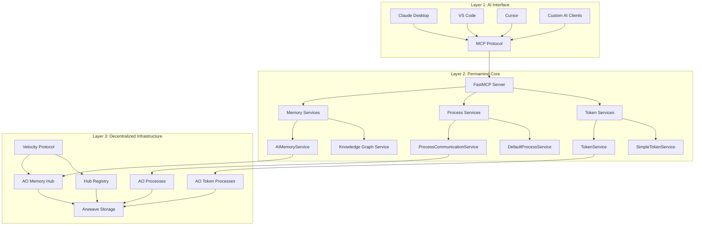

# Permamind Architecture Guide

This guide explains the technical architecture of Permamind, the world's first permanent, decentralized AI memory system built on Arweave and AO.

## System Overview

Permamind is built on a three-layer architecture that combines the Model Context Protocol (MCP) for AI tool integration, AO for decentralized computation, and Arweave for permanent data storage.



## Core Components

### 1. MCP Server Layer

#### FastMCP Framework
- **Purpose**: Provides the Model Context Protocol interface for AI clients
- **Technology**: TypeScript with Zod schema validation
- **Features**:
  - Server-sent events (SSE) transport
  - Automatic tool discovery and validation
  - Type-safe parameter handling
  - Error handling and response formatting

#### Tool Definition System
```typescript
interface MCPTool {
  name: string;
  description: string;
  inputSchema: ZodSchema;
  handler: (params: unknown) => Promise<ToolResponse>;
}
```

### 2. Memory Management Layer

#### AIMemoryService
- **Core Function**: Enhanced AI memory operations with metadata
- **Key Features**:
  - Importance scoring (0-1 scale)
  - Memory type classification
  - Rich context information
  - Access pattern tracking
  - Batch operations for efficiency

```typescript
interface AIMemory extends Memory {
  importance: number;        // Relevance score 0-1
  memoryType: MemoryType;   // conversation, knowledge, reasoning, etc.
  context: MemoryContext;   // Session, topic, domain metadata
  metadata: {
    tags: string[];         // User-defined tags
    accessCount: number;    // Usage tracking
    lastAccessed: string;   // Timestamp
  };
}
```

#### Knowledge Graph Service
- **Purpose**: Manage relationships between memories
- **Capabilities**:
  - Typed relationships (causes, supports, contradicts, etc.)
  - Strength scoring for connection quality
  - Circular reference detection
  - Shortest path analysis
  - Relationship analytics

```typescript
interface MemoryLink {
  targetId: string;
  type: RelationshipType;   // causes, supports, contradicts, extends, references
  strength: number;         // Connection strength 0-1
}
```

#### Reasoning Chain Service
- **Function**: Document AI decision-making processes
- **Structure**:
```typescript
interface ReasoningTrace {
  chainId: string;
  steps: ReasoningStep[];   // Sequential decision steps
  outcome: string;          // Final decision or result
}

interface ReasoningStep {
  stepType: 'observation' | 'thought' | 'action';
  content: string;
  confidence: number;
  timestamp: string;
}
```

### 3. Process Communication Layer

#### ProcessCommunicationService
- **Purpose**: Natural language interface to AO processes
- **Key Functions**:
  - Markdown documentation parsing
  - Natural language request interpretation
  - Parameter extraction from plain English
  - AO message construction and routing
  - Response interpretation and formatting

#### Natural Language Processing Pipeline
1. **Request Analysis**: Parse user intent from natural language
2. **Handler Matching**: Find appropriate process handlers
3. **Parameter Extraction**: Extract values using regex patterns
4. **Message Construction**: Build AO-compatible message tags
5. **Response Interpretation**: Parse and format AO responses

```typescript
interface HandlerInfo {
  action: string;           // Handler name (PascalCase)
  description: string;      // Human-readable description
  parameters: ParameterInfo[];
  isWrite: boolean;         // Determines read vs write operation
  examples?: string[];      // Usage examples
}
```

#### DefaultProcessService
- **Function**: Auto-detect common AO process types
- **Supported Types**:
  - Token processes (ERC20-like)
  - Future: NFT, DAO, DeFi processes
- **Detection Methods**:
  - Handler pattern matching
  - Request content analysis
  - Process response introspection

### 4. Token System Layer

#### Advanced Minting Strategies
Permamind implements sophisticated token minting patterns:

##### Basic Minting
```lua
-- Simple owner-controlled minting
if msg.From == Owner then
    Balances[msg.Target] = (Balances[msg.Target] or 0) + msg.Quantity
end
```

##### Cascade Minting
```lua
-- Rewards for large transfers
if msg.Quantity >= ThresholdAmount and RewardsIssued < MaxRewards then
    local reward = math.floor(msg.Quantity * RewardPercentage / 100)
    Balances[msg.From] = (Balances[msg.From] or 0) + reward
    RewardsIssued = RewardsIssued + 1
end
```

##### Double Mint Strategy
```lua
-- Mint to both sender and recipient
if msg.From == Owner then
    Balances[msg.Target] = (Balances[msg.Target] or 0) + msg.Quantity
    Balances[msg.From] = (Balances[msg.From] or 0) + msg.Quantity
end
```

#### Credit Notice System
Permamind implements proper AO token transfer detection:

```lua
-- Listen for credit notices, not direct transfers
Handlers.add("Credit-Notice", 
  Handlers.utils.hasMatchingTag("Action", "Credit-Notice"),
  function (msg)
    local quantity = tonumber(msg.Quantity)
    local sender = msg.Sender
    
    -- Update balances based on credit notice
    Balances[ao.id] = (Balances[ao.id] or 0) + quantity
    
    -- Trigger any minting logic
    handleMinting(sender, quantity)
  end
)
```

### 5. AO Integration Layer

#### Message Routing System
```typescript
interface AOMessage {
  processId: string;        // Target AO process
  tags: Tag[];             // Message metadata
  data?: string;           // Optional message body
  isWrite?: boolean;       // Operation type hint
}
```

#### Read vs Write Detection
```typescript
const WRITE_ACTIONS = new Set([
  "Transfer", "Mint", "Burn", "Register", 
  "Vote", "Stake", "Withdraw", "Update-Profile"
]);

function isWriteOperation(tags: Tag[], isWrite?: boolean): boolean {
  if (isWrite !== undefined) return isWrite;
  
  const actionTag = tags.find(tag => tag.name === "Action");
  return actionTag ? WRITE_ACTIONS.has(actionTag.value) : false;
}
```

#### Process Template System
Permamind auto-generates process templates for common patterns:

```typescript
interface ProcessDefinition {
  name: string;
  processId: string;
  handlers: HandlerInfo[];
}

// Example token process template
const DEFAULT_TOKEN_PROCESS: ProcessDefinition = {
  name: "AO Token Process",
  processId: "",
  handlers: [
    {
      action: "Balance",
      description: "Get token balance for an account",
      parameters: [
        { name: "Target", type: "string", required: false }
      ],
      isWrite: false
    },
    // ... more handlers
  ]
};
```

### 6. Storage and Persistence Layer

#### Arweave Integration
- **Permanent Storage**: All memories stored forever on Arweave blockchain
- **Immutable Records**: Data cannot be modified once stored
- **Decentralized Access**: No single point of failure
- **Cryptographic Verification**: All data cryptographically signed

#### Velocity Protocol Integration
- **Hub System**: Decentralized memory organization
- **Event-Based Architecture**: Structured data using standard event types
- **Registry System**: Hub discovery and management
- **Protocol Extensions**: AI-specific event types (Kinds 10, 11, 23, 40)

#### Hub Registry Schema
```typescript
interface HubRegistration {
  zoneId: string;           // Unique zone identifier
  processId: string;        // AO process handling the hub
  owner: string;            // Hub owner address
  permissions: {
    read: string[];         // Read access list
    write: string[];        // Write access list
  };
  metadata: {
    name: string;
    description: string;
    tags: string[];
  };
}
```

## Data Flow Architecture

### Memory Storage Flow
1. **AI Client Request** → MCP tool call
2. **Parameter Validation** → Zod schema validation
3. **Memory Processing** → AIMemoryService enhancement
4. **Tag Generation** → Velocity Protocol event tags
5. **AO Message** → Send to memory hub process
6. **Arweave Storage** → Permanent data storage
7. **Response** → Confirmation back to AI client

### Memory Retrieval Flow
1. **Search Request** → Advanced search parameters
2. **Filter Construction** → VIP01 query building
3. **AO Query** → Fetch from memory hub
4. **Data Processing** → Event to memory conversion
5. **Ranking** → Relevance-based sorting
6. **Response** → Formatted results to AI client

### Process Communication Flow
1. **Natural Language Input** → Plain English request
2. **Intent Analysis** → Extract operation and parameters
3. **Handler Matching** → Find appropriate process handler
4. **Message Construction** → Build AO message with tags
5. **Process Execution** → Send to target AO process
6. **Response Processing** → Interpret and format response
7. **Result Delivery** → Structured response to AI client

## Security Architecture

### Cryptographic Security
- **Wallet-Based Identity**: Each instance uses Arweave wallet for signing
- **Message Signing**: All AO messages cryptographically signed
- **Data Integrity**: Arweave provides cryptographic verification
- **Access Control**: Hub-based permission systems

### Input Validation
- **Schema Validation**: Zod schemas for all tool parameters
- **Sanitization**: Input sanitization before AO message construction
- **Rate Limiting**: Built-in rate limiting for AO operations
- **Error Handling**: Comprehensive error boundaries

### Privacy Considerations
- **Local Key Storage**: Private keys stored locally only
- **Optional Seed Phrases**: Users control their identity persistence
- **Permissionless Protocol**: No centralized data collection
- **Open Source**: Full transparency of memory handling

## Performance Architecture

### Optimization Strategies
- **Async Operations**: All I/O operations use async/await
- **Batch Processing**: Bulk memory operations for efficiency
- **Caching**: Intelligent caching of process definitions
- **Connection Pooling**: Efficient AO network connections

### Scalability Design
- **Horizontal Scaling**: Multiple hub instances
- **Load Distribution**: Spread across AO network
- **Storage Efficiency**: Optimized event structures
- **Query Optimization**: Efficient memory retrieval patterns

### Monitoring and Observability
- **Performance Metrics**: Response time tracking
- **Error Logging**: Comprehensive error reporting
- **Usage Analytics**: Memory access patterns
- **Health Checks**: System status monitoring

## Extension Points

### Custom Process Types
```typescript
interface ProcessTemplate {
  detectHandlers: (handlers: string[]) => boolean;
  generateDefinition: (processId: string) => ProcessDefinition;
  parseRequest: (request: string) => OperationResult;
}
```

### Custom Memory Types
```typescript
interface CustomMemoryType {
  type: string;
  validator: (memory: Partial<AIMemory>) => boolean;
  enhancer: (memory: Partial<AIMemory>) => AIMemory;
  indexer: (memory: AIMemory) => Tag[];
}
```

### Plugin Architecture
Future versions will support:
- Custom search algorithms
- Additional storage backends
- Extended relationship types
- Custom analytics engines

## Deployment Architecture

### Development Mode
```bash
npm run dev  # Local development with hot reload
```

### Production Deployment
```bash
npm run build && npm start  # Compiled production server
```

### Docker Deployment
```dockerfile
FROM node:20-alpine
WORKDIR /app
COPY package*.json ./
RUN npm install --production
COPY dist/ ./dist/
CMD ["npm", "start"]
```

### Cloud Deployment
- **Serverless**: AWS Lambda, Vercel Functions
- **Container**: Docker, Kubernetes
- **VPS**: Traditional virtual private servers
- **Edge**: Cloudflare Workers, Deno Deploy

This architecture provides a robust, scalable, and truly decentralized AI memory system that leverages the best of Web3 infrastructure while maintaining an excellent developer experience through modern TypeScript and MCP integration.